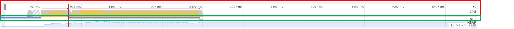

# 프론트엔드 성능 최적화 가이드 정리

## Web Vitals

웹 페이지에 대해서 구글이 제시하는 성적표

### FCP(First Contentful Paint)

- 페이지가 로드될 때 브라우저가 DOM 콘텐츠의 첫 번째 부분을 렌더링하는 데 걸리는 시간에 관한 지표
- 총점 계산할 때, 10%의 가중치

### SI(Speen Index)

- 페이지 로드 중에 콘텐츠가 시각적으로 표시되는 속도를 나타내는 지표
- 전체 화면 중에서 일부 콘텐츠가 시각적으로 표시되었을 때 로드된 것으로 계산됨.
- 총점 계산할 때, 10%의 가중치

### LCP(Largest Contentful Paint)

- 페이지가 로드될 때 화면 내에 있는 가장 큰 이미지나 텍스트 요소가 렌더링되기까지 걸리는 시간을 나타내는 지표
- 총점 계산 가중치 25%

### TTI(Time to Interactive)

- 사용자가 페이지와 상호 작용이 가능한 시점까지 걸리는 시간을 측정한 지표
- 상호 작용이란 클릭 또는 키보드 누름 같은 사용자 입력을 의미
- 총점 계산 가중치 10%

### TBT(Total Blocking Time)

- 페이지가 클릭, 키보드 입력 등의 사용자 입력에 응답하지 않도록 차단된 시간을 총합한 지표
- 측정은 FCP와 TTI 사이의 시간동안 일어나며 메인 스레드를 독점하여 다른 동작을 방해하는 작업에 걸린 시간을 총합한다.
- 총점 계산 가중치 30%

### CLS(Cumulative Layout Shift)

- 페이지 로드 과정에서 발생하는 예기치 못한 레이아웃 이동을 측정한 지표.
- 레이아웃 이동이란 화면상에서 요소의 위치나 크기가 순차적으로 변하는 것을 말한다.
- 총점 계산 가중치 15%

## 크롬 개발자 도구 Performance 패널

### CPU 차트, Network 차트

- 제일 상단(Network 타임라인 위)

#### CPU 차트

- _위 이미지 빨간박스 부분_

* 시간에 따라 CPU가 어떤 작업에 리소스를 사용하고 있는지 비율로 보여줌.

- 이 차트를 통해 어느 타이밍에 어떤 작업이 주로 진행되고 있는 지 파악
  > - 자바스크립트 노란색
  > - 렌더링/레이아웃 보라색
  > - 페인팅 초록색
  > - 기타 시스템 작업 회색

* **빨간색 선은 병목이 발생하는 지점 의미**.즉, 특정 작업이 메인 스레드를 오랫동안 잡아 두고 있다는 뜻

#### Network 차트

- _위 이미지 초록박스 부분_

* CPU차트 밑에 막대 형태로 표시, 대략적인 네트워크 상태 보여줌

- 진학 막대는 우선순위가 높은 네티워크 리소스, 옅은 막대는 우선순위가 낮은 네트워크 리소스 의미

### Network 타임라인

- Network 패널과 유사하게 서비스 로드 과정에서 네트워크 요청을 시간 순서에 따라 보여줌

* 네트워크 요청 막대에서 의미하는 것
  > - 왼쪽 회색 선 : 초기 연결 시간
  > - 막대의 옅은 색 영역 : 요청을 보낸 시점부터 응답을 기다리는 시점까지의 시간(TTFB, Time to First Byte)
  > - 막대의 짙은 색 영역 : 콘텐츠 다운로드 시간
  > - 오른쪽 회식 선 : 해당 요청에 대한 메인 스레드의 작업 시간
* 파란색 막대는 HTML의미

### Frames, Timings, Main

#### Timings

- User Timing API를 통해 기록된 정보를 기록
- 여기 표시된 막대들은 리액트에서 각 컴포넌트의 렌더링 시간을 측정 한 것
- _리액트의 User Timing API코드는 리액트 버전 17 이후로 정확성 및 유지 보수 문제로 지원 종료. 캡처한 프로젝트는 리액트 버전 16이라서 보임_

#### Main

- 메인 스레드에서 실행되는 작업을 플레임 차트로 보여줌
  > - 플레임 차트 : 소프트웨어 작업을 손쉽게 추적하기 위해 개발된 계층형 데이터 시각화 기법
  >   - X축은 시간의 흐름, Y축은 스택의 깊이
  >   - 막대가 아래쪽에 있을수록 상위작업, 위쪽으로 갈수록 하위작업
  >   - 기본적인 플레임 차트는 아래에서 위로 그려지지만, **크롬 개발자 도구의 플레임 차트는 위에서 아래로**
- 이를 통해 어떤 작업이 오래 걸리는지 파악할 수 있다.
