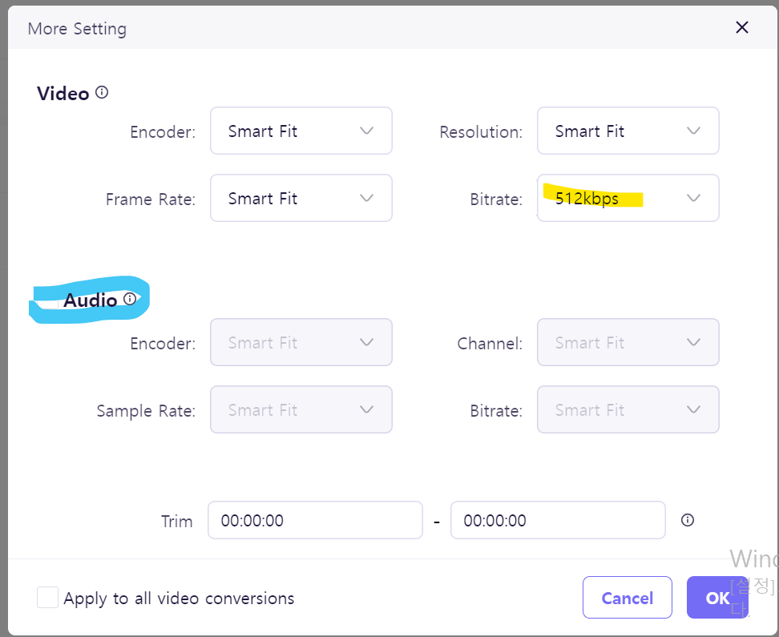

# 동영상 최적화

- 동영상 파일은 이미지처럼 하나의 요청으로 모든 영상을 다운로드하지 않는다.
- 동영상 콘텐츠의 특성상 파일 크기가 크기 때문에 당장 재생이 필요한 앞부분을 먼저 다운로드한 뒤 순차적으로 나머지 내용을 다운로드한다. => 요청이 여러개로 나뉨

#### 동영상 최적화는 이미지 최적화와 비슷. 가로와 세로 사이즈를 줄이고, 압축 방식을 변경하여 용량 줄임

- 동영상을 더 작은 사이즈로 압축하는 작업은 동영상의 화질을 낮추는 작업. => <span style='background-color: #fff51d; color: black;'>동영상이 서비스의 메인 콘텐츠라면 이 작업 비추</span>

## 동영상 압축 서비스를 이용하여 압축

- Media.io라는 서비스 이용
- 확장자 WebM으로 선택
  - **WebM : WebP와 동일하게 구글에서 개발한 동영상 포맷**



- Bitrate 제일 낮은 512Kbps로 설정
  - Bitrate : 특정한 시간 단위마다 처리하는 비트의 수로 동영상에서는 1초에 얼마나 많은 정보를 포함하는가를 의미. 이 값이 크면 화질이 좋고 파일 사이즈 큼
- Audio 체크 해제

* 위와 같이 설정하고 변환 후 다운로드하면 동영상 크기가 원본에 비해 1/5 작아짐.

## 압축된 동영상 예제 프로젝트에 적용

#### 적용 전

```html
<video
  src="{video}"
  className="absolute translateX--1/2 h-screen max-w-none min-w-screen -z-1 bg-black min-w-full min-h-screen"
  autoplay
  loop
  muted
/>
```

#### 적용 후

````js
import video from "../assets/banner-video.mp4";
import video_webm from "../assets/banner-video.webm";

function BannerVideo() {
...
 <video className="absolute translateX--1/2 h-screen max-w-none min-w-screen -z-1 bg-black min-w-full min-h-screen"
          autoPlay
          loop
          muted
        >
          <source src={video_webm} type="video/webm" />
          <source src={video} type="video/mp4" />
        </video>
...
}
```

## 동영상 압축 후 저하된 화질을 보완할 수 있는 몇가지 방법

#### 패턴과 필드를 이용하는 것

- 말 그대로 동영상 위에 패턴을 넣거나 동영 상위에 필터를 씌우는 방법

* 이렇게 하면 동영상이 패턴이나 필터에 가려져서 사용자는 동영상의 화질이 좋지 않음을 쉽게 인지 할 수 없다.

* 패턴만으로 충분하지 않다면 필터를 이용
* <span style='background-color: #fff51d; color:black;'>다양한 필터 중 가장 효과 적인 것은 **blur**</span>
  - video 요소에 css코드로 아래 처럼 넣어주면 동영상이 흐려짐
  * 동영상을 굳이 있는 그대로 보여 줄 필요가 없을 때, 배경만으로 가볍게 사용할 때 효과적
  ```css
  filter: blur(10px);
````
