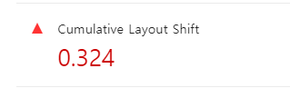

# 레이아웃 이동 피하기

## 레이아웃 이동이란 ?

- 화면상의 요소 변화로 레이아웃이 갑자기 밀리는 현상

* 사용자 경험에 좋지 않은 영향을 줌
* 이 때문에 Lighthouse에서는 웹 페이지에서 레이아웃 이동이 얼마나 발생하는지를 나타내는 지표로 **CLS(Cumulative Layout Shift)** 라는 항목을 두고 성능 점수에 포함했다.

  - CLS는 0~1까의 값을 가짐. 레이아웃 이동이 전혀 발생하지 않으면 0, 그 반대는 1로 계산, 권장하는 점수는 0.1이하

    

* 좀 더 직접적인 원인 파악을 위해 <span style='background-color: #fff51d; color: black;'> Performance 패널에서 Experience 섹션을 보면 Layout Shift라는 이름의 빨간 막대가 표시되는 데, 이것은 해당 시간에 레이아웃 이동이 발생했다는 의미</span>

## 레이아웃 이동의 원인

다양한 원인이 있지만 그중 가장 흔한 4가지 경우

- 사이즈가 미리 정의되지 않은 이미지 요소
- 사이즈가 미리 정의되지 않은 광고 요소
- 동적으로 삽입된 콘텐츠
- 웹 폰트(FOIT, FOUT) : 폰트에 따라 글자의 크기가 조금씩 다른데, 이러한 차이 때문에 다른 요소의 위치에 영향을 줄 수 있다.

## 레이아웃 이동 해결

- **레이아웃 이동을 일으키는 요소의 사이즈를 지정하면 된다.**

* 즉, 해당 요소의 사이즈를 미리 예측할 수 있다면 또는 이미 알고 있다면 해당 사이즈만큼 공간을 확보해 놓는 것

- 이미지 사이즈는 브라우저의 가로 사이즈에 따라 변함. 따라서 <span style='background-color: #fff51d; color: black;'>단순히 너비와 높이를 고정하는 것이 아니라 이미지의 너비, 높이 비율로 공간을 잡아두는 것</span>

### padding을 이용하여 박스를 만든 뒤, 그 안에 이미지를 absolute로 띄우는 방식

- 전통적인 방법

* 16: 9가 아닌 1:1로 표시해야한다면 padding-top을 100%로 설정

```html
<div class="wrapper">
  
</div>
```

```css
.wrapper {
  position: relative;
  width: 160px;
  padding-top: 56.25%; /* 16: 9 비율*/
}

.image {
  position: absolute;
  width: 100%;
  height: 100%;
  top: 0;
  left: 0;
}
```

### aspect-ratio라는 CSS 속성을 이용

- 위처럼 하면 padding의 퍼센트를 매번 계산해야하고 코드가 직관적이지 않음. 이러한 불편함 때문에 이 방법이 나옴

* 브라우저 호환성 문제 있을 수 있음.

```html
<div class="wrapper">
  
</div>
```

```css
.wrapper {
  width: 100%;
  aspect-ratio: 16/9;
}

.image {
  width: 100%;
  height: 100%;
}
```
