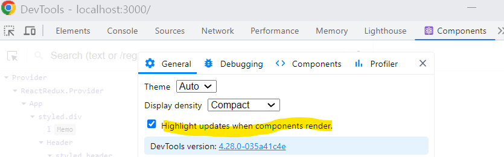

# 리덕스 렌더링 최적화

- react developer tools의 highlight updates when component render 항목을 이용하여 최대한 불필요한 렌더링을 하지 않도록 성능을 최적화 한다.
  

## 리렌더링의 원인

- 리덕스 때문임. 리덕스 상태를 구독하고 있는 컴포넌트는 리덕스 상태 변화에 따라 불필요하게 리렌더링 될 수 있다.
- useSelector은 인자로 넣은 함수의 반환값이 이전값과 같다면 해당 컴포넌트를 리렌더링 하지않고, 반환 값이 이전 값과 다르면 리렌더링함.

* 아래 처럼 객체를 새로 만들어서 새로운 참조 값을 반환하는 형태이면 실제로 modalVisible, bgColor, src, alt의 값이 달라진 게 없더라도 리렌더링 발생

```js
const { modalVisible, bgColor, src, alt } = useSelector((state) => ({
  modalVisible: state.imageModal.modalVisible,
  bgColor: state.imageModal.bgColor,
  src: state.imageModal.src,
  alt: state.imageModal.alt,
}));
```

## useSelector 문제 해결

- 위와 같은 문제를 해결하는 방법에는 크게 2가지 있다.

1. 객체를 새로 만들지 않도록 반환 값을 나누는 방법
2. Equality Function을 사용하는 방법

### 객체를 새로 만들지 않도록 반환 값 나누기

```js
const modalVisible = useSelector((state) => state.imageModal.modalVisible);
const bgColor = useSelector((state) => state.imageModal.bgColor);
const src = useSelector((state) => state.imageModal.src);
const alt = useSelector((state) => state.imageModal.alt);
```

### 새로운 Equality Function 사용

- Equality Function이란 useSelector의 옵션으로 넣는 함수로, 리덕스 상태가 변했을 때 useSelector가 반환해야 하는 값에도 영향을 미쳤는 지 판단하는 함수.
  - 즉, 이전 반환 값과 현재 반환 값을 비교하는 함수

* 직접 구현하여 넣을 수도 있고 리덕스에서 제공하는 함수를 사용할 수 있다.

- **shallowEqual** : useSelector 두번째 인자로 값을 반환
  - 참조 값을 비교하는 것이 아니라 객체 내부에 있는 modalVisible, bgColor, src, alt를 직접 비교하여 동일한지 아닌지 판단

```js
const { modalVisible, bgColor, src, alt } = useSelector(
  (state) => ({
    modalVisible: state.imageModal.modalVisible,
    bgColor: state.imageModal.bgColor,
    src: state.imageModal.src,
    alt: state.imageModal.alt,
  }),
  shallowEqual
);
```
