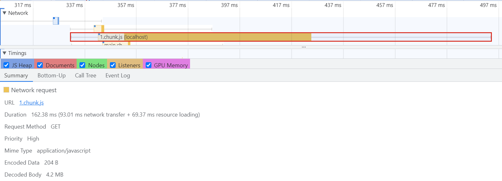
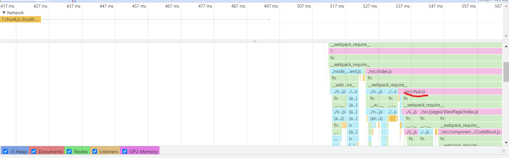
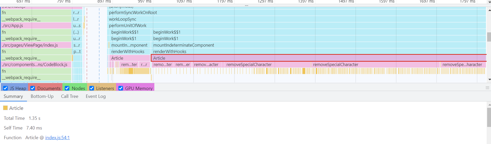

# 병목 코드 최적화


- chunk.js 파일에서 2,481ms동안 자바스크립트가 실행되었음을 알 수 있다.
- 메인 스레드의 작업을 상세하게 살펴보고 느린 작업이 무엇인지 확인하기 위해 **Performance** 패널 활용

### 페이지 로드과정 살펴보기


- chunk.js의 로드시간이 매우 길다.



- 해당 막대를 클릭해 Summary 탭을 보면 파일 크기가 4.2MB로 굉장히 크다는 것을 알 수 있다.
  - _물론 개발환경이라 번들 파일이 경량화되어 있지 않기 때문에 더 큼. 그럼에도 너무 크다_



- chunk.js 다운로드가 끝난 시점을 보면, 이어서 자바스크립트 작업이 실행되고 있다.
- 빨간 박스로 표시된 곳을 보면 App.js라는 항목 보임. 즉, 이 작업들은 리액트 코드를 실행하는 작업이라고 볼 수 있다.



- Article이라는 작업이(Article 컴포넌트를 렌더링 하는 작업으로 보임) 실행시간이 무려 1.35초 걸림. 단순히 데이터를 화면에 렌더링하는 것 뿐인데 이상하다.

- 그 아래로 하나 더 내려가보면 removeSpecialCharacter이란 작업 보임. 이 작업이 Article 컴포넌트 렌더링 시간을 길어지게 했다.

* 기존 코드

```

/*
 * 파라미터로 넘어온 문자열에서 일부 특수문자를 제거하는 함수
 * (Markdown으로 된 문자열의 특수문자를 제거하기 위함)
 * */
function removeSpecialCharacter(str) {
  const removeCharacters = [
    "#",
    "_",
    "*",
    "~",
    "&",
    ";",
    "!",
    "[",
    "]",
    "`",
    ">",
    "\n",
    "=",
    "-",
  ];
  let _str = str;
  let i = 0,
    j = 0;

  for (i = 0; i < removeCharacters.length; i++) {
    j = 0;
    while (j < _str.length) {
      if (_str[j] === removeCharacters[i]) {
        _str = _str.substring(0, j).concat(_str.substring(j + 1));
        continue;
      }
      j++;
    }
  }

  return _str;
}
```

- 리팩토링 후

```
function removeSpecialCharacter(str) {
  // articles API에 글자수 90021자, 그러나 리스트 화면에 사용되는 글자수 대략 200자 정도라서 잘라줌
  let _str = str.substring(0, 300);
  _str = str.replace(/[#_*~&;![\]`>\n=\->]/g, "");
  return _str;
}

```
