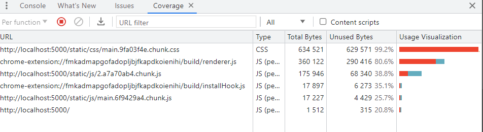

# 불필요한 CSS제거


- 해당 항목은 사용하지 않는 CSS코드를 제거하면 성능에 긍정적인 영향을 줄 수 있다는 의미
- 내용을 보면 main.chunk.css가 620KiB인데, 사용하지 않는 코드를 제거하면 614KiB를 줄일 수 있다고 함.

#### 더 자세히 보기위해 Coverage패널 이용

- 실제로 실행하는 코드가 얼마나 되는지 알려주며 그 비율 표시해줌.
- 이 패널을 통해 서비스 코드에 불필요한 코드가 얼마나 있는지 확인할 수 있다.
  

* Unused Bytes(사용하지 않는 바이트)와 Usage Visualization(사용량 시각화) 항목에서 전체 코드 대비 실행된 코드의 양을 비율로 보여준다.
* 2.chunk.js 파일을 보면 대략 38% 정도의 코드를 실행하고 있지 않다고 나옴.

  - 하지만 페이지를 Coverage 패널의 기록이 진행 중인 상태에서 페이지를 이동하고 기타 동작들을 해 보면 점점 코드 사용 비율이 증가함
  - 왜냐면 자바스크립트의 경우 if문 같은 조건이 걸려 있어 분기되는 코드가 많아 이런 코드는 경우에 따라 실행이 안 됐다가도 특정 동작에 의해 다시 실행되기도 하기 때문에

  * 그렇다 보니 자바스크립트 코드의 커버리지는 어느 정도 감안해야 함.

* main.chunk.css 파일의 코드가 99%나 된다고 함.

  - 해당 항목을 눌러 보면 Sources 패널에서 해당 코드가 뜨면서 어떤 코드가 실행되었고, 실행되지 않았는 지 자세히 볼 수 있다.
  - 코드의 왼쪽에 파란 막대는 해당 코드가 실행되어 적용되었다는 의미
  - 빨간 막대는 실행되지 않았다는 의미

    

  - 실행되지 않은 CSS 코드를 살펴보면 상당히 많은 유틸 클래스가 사용되지 않았음을 알 수 있다.

  - 이 클래스들은 모두 Tailwind CSS 라이브러리에서 추가된 것으로, 개발할 때는 미리 만들어진 클래스를 통해 쉽고 빠르게 스타일을 적용할 수 있다는 장점이 있었지만, 막상 빌드하고 나니 사용하지 않은 스타일도 함께 빌드되어 파일의 사이즈를 크게 만든다는 단점이 있다.

### PurgeCSS

- https://purgecss.com/

* 사용하지 않는 CSS 코드를 제거하는 방법 여러가지 있겠지만, PurgeCSS라는 툴 사용해서 해결

- PuregeCSS는 파일에 들어 있는 모든 키워드를 추출하여 해당 키워드를 이름으로 갖는 CSS 클래스만 보존하고 나머지 매칭되지 않은 클래스는 모두 지우는 방식으로 CSS 파일을 최적화

```
 npm install --save-dev purgecss
```

```
purgecss --css ./build/static/css/*.css --output ./build/static/css/ --content ./build/index.html ./build/static/js/*.js
```

> - --css : 불필요한 클래스를 제거할 파일
> - --output : 동일한 위치를 지정함으로 새로운 파일을 생성하는 대신 기존 CSS 파일을 덮어 쓰도록 함.
> - --content : 키워드를 추출할 파일, 빌드된 HTML과 자바스크립트 파일을 전부 넣어준다.

- devDependency로 설치되었으므로, 위 스크립트를 그대로 실행하면 제대로 실행되지 않을 것이다.
- 프로젝트에 설치된 의존성 라이브러리를 사용하기 위해서는 npx를 사용하거나 package.json의 scripts에 넣어 줘야 한다.

  

* npm run purge 실행하면 별다른 메시지 없이 실행된다. 하지만 서비스를 재시작한 후, Covergage 패널을 보면 이전과 달리 CSS 파일의 사이즈와 사용되지 않은 코드의 비율이 달라진걸 볼 수 있다.
  
* 해결된 것 같지만 막상 서비스를 살펴보면 아래처럼 화면이 이상함. 일부 스타일이 제대로 적용되지 않은 것처럼 보임
  
* 요소 검사를 통해 해당 요소를 살펴보면 lg:m-8과 lg:ml-32 클래스의 스타일이 제대로 정의되어 있지 않은 것을 알 수 있다.
  - 해당 현상은 PurgeCSS가 텍스트 키워드를 추출할 때 콜론(:)문자를 하나의 키워드로 인식하지 못하고 잘라 버렸기 때문에 생기는 현상
  * lg:m-8이 lg와 m-8이라는 각각 다른 키워드로 인식된 것
    
* 해당 문제는 defaultExtractor 옵션을 통해 해결할 수 있다.

  - 이 옵션은 PurgeCSS가 키워드를 어떤 기준으로 추출할지 정의하는 옵션

  * 이 옵션을 설정하기 위해 config 파일 필요, 프로젝트 최상위 경로에 생성

    - purgecss.config.js

    * defaultExtractor에 정의되는 함수는 인자로 대상 파일의 전체 코드를 넘겨받고 문자열 배열을 반환함.
    * 인자로 넘겨받은 전체 코드는 match 메서드를 통해 정규식에 만족하는 키워드를 배열 형태로 추출
    * 아래 정규식은 영문자,숫자,밑줄 문자(\_), 콜론(:), 하이픈(-)으로 이루어진 키워드를 추출하는 정규식

    ```js
    module.exports = {
      defaultExtractor: (content) => content.match(/[\w\:\-]+/g) || [],
    };
    ```

    - 설정 파일 경로 지정

    ```
    purgecss --css ./build/static/css/*.css --output ./build/static/css/ --content ./build/index.html ./build/static/js/*.js --config ./purgecss.config.js
    ```

    - 수정 내용 적용을 위해 빌드후 다시 실행

    ```
    npm run build
    npm run purge
    ```
