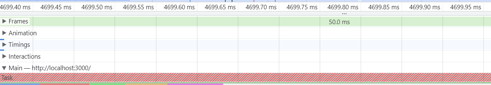
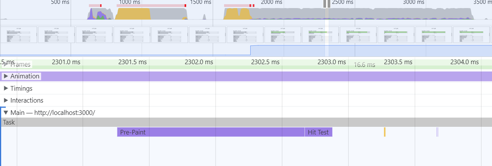

# CSS 애니메이션 최적화

### 애니메이션의 원리

- 쟁크(jank) : 애니메이션이 끊기는 현상
- 일반적으로 사용하는 디스플레이의 주사율 60Hz. 즉, 1초에 60장의 정지된 화면을 빠르게 보여준다는 의미.
  - 브라우저도 이에 맞춰 최대 60FPS로 1초에 60장의 화면을 새로 그림

* **쟁크 현상이 발생하는 이유** : 브라우저가 정상적으로 60FPS로 화면을 그리지 못했기 때문이라고 유추할 수 있다.
  - 예를 들어, CPU가 다른 일을 하느라 바빠서 초당 60장의 화면을 그리지 못하고, 40장의 화면, 아니면 더 적게 20장의 화면을 그려 애니메이션이 끊기는 느낌을 준 것

### 크롬 개발자 툴 performance 패널에서 브라우저 화면 갱신 주기 보기



- 회색 세로선을 볼 수 있는 데 브라우저가 화면을 갱신하는 주기임.
- 앞서 브라우저는 1초에 화면을 최대 60번 그린다고 했는데, 화면을 그리는 시점이 바로 이 선임



- 위 화면을 보면 리플로우 작업이 브라우저가 화면을 갱신하는 시점인 회색 선을 넘고 있다.
- 즉, 화면을 1/60초 안에 그려서 보여줘야 하는데 리플로우가 발생하여 모든 단계를 밟느라 필요한 화면을 제때 그려내지 못해서 **정크**발생

### 하드웨어 가속

- 리플로우나 리페인트 과정은 브라우저의 리소스를 많이 잡아먹는다. 이를 피하는 방법은?
  - transform, opacity와 같은 속성을 사용하는 방법
- 이런 속성을 사용하면 해당 요소를 별도의 레이어로 분리하고 작업을 GPU에 위임하여 처리함으로써 레이아웃 단계와 페인트 단계를 건너뛸 수 있다.
  이를 **하드웨어 가속**이라고 함.

#### 즉, 하드웨어 가속이란 ?

CPU에서 처리해야할 작업을 GPU에 위임하여 더욱 효율적으로 처리하는 방법

- GPU는 애초에 그래픽 작업을 처리하기 위해 만들어진 것이므로 화면을 그릴 때 활용하면 굉장히 빠름
- 하드웨어 가속을 사용하려면 요소를 별도의 레이어로 분리하여 GPU로 보내야 하는데, transfrom, opacity 속성이 이 역할을 함.

* 분리된 레이어는 GPU에 의해 처리되어 레이아웃, 페인트 단계 없이 화면상의 요소 변경 가능

> - transform : translate()는 처음부터 레이어를 분리하지 않고 변화가 일어나는 순간 레이어를 분리
> - transform : translate3d()나 scale3d()와 같은 3d 속성들, 또는 will-change 속성은 처음부터 레이어를 분리
> - 레이어가 너무 많아지면 그만큼 메모리를 많이 사용하기 때문에 주의

### 애니메이션 최적화

- 최적화 전 소스코드
  - 애니메이션이 width에 적용되어 있음

```javascript
const BarGraph = styled.div`
  position: absolute;
  left: 0;
  top: 0;
  width: ${({ width }) => width}%;
  transition: width 1.5s ease;
  height: 100%;
  background: ${({ isSelected }) =>
    isSelected ? "rgba(126, 198, 81, 0.7)" : "rgb(198, 198, 198)"};
  z-index: 1;
`;
```

- width => transform 속성으로 변경
  - 미리 막대의 너비를 width 100%로 채워두고 scale을 이용하여 비율에 따라 줄이는 방식
  - scaleX 안에 있는 width는 퍼센트 값이기 때문에 1이하의 실수로 값을 변환
  - transform-origin: center left => transform에 scaleX값만 설정하면 scale의 기준점이 기본적으로 중앙에 있기 때문에 가운데 정렬이 됨, 그래서 왼쪽으로 기준점을 변경

```javascript
const BarGraph = styled.div`
  position: absolute;
  left: 0;
  top: 0;
  width: 100%;
  transform: scaleX(${({ width }) => width / 100});
  transform-origin: center left;
  transition: width 1.5s ease;
  height: 100%;
  background: ${({ isSelected }) =>
    isSelected ? "rgba(126, 198, 81, 0.7)" : "rgb(198, 198, 198)"};
  z-index: 1;
`;
```
