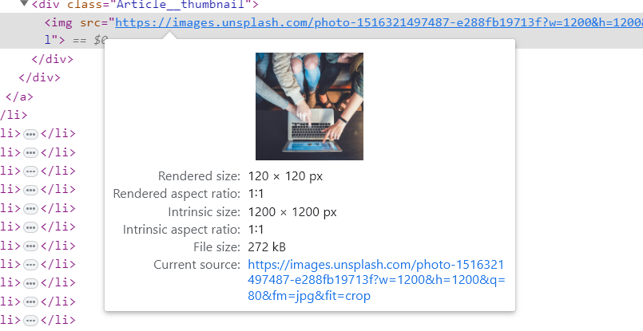

# 이미지 사이즈 최적화

- 이는 이미지를 적절한 사이즈로 사용하도록 제안

* 이미지를 적절한 사이즈로 변경하면 용량을 대략 3000KiB정도 줄일 수 있고, 이로써 이미지 로드에 소용되는 시간을 1.13초 단축할 수 있다고 함.

- 위 내용을 보면 실제 이미지 사이즈는 1200\*1200px인데, 화면에 그려지는 이미지의 사이즈는 120\*120px라고 한다.
- 처음부터 120\*120px에 맞는 이미지를 사용하라는 뜻!

* 요즘 사용되는 레티나 디스플레이 같은 공간(픽셀)에 더 많은 픽셀을 그릴 수 있기 때문에, **너비 기준 두배 정도 큰 이미지를 사용하는 것이 적절**, 즉 240\*240사이즈 사용
