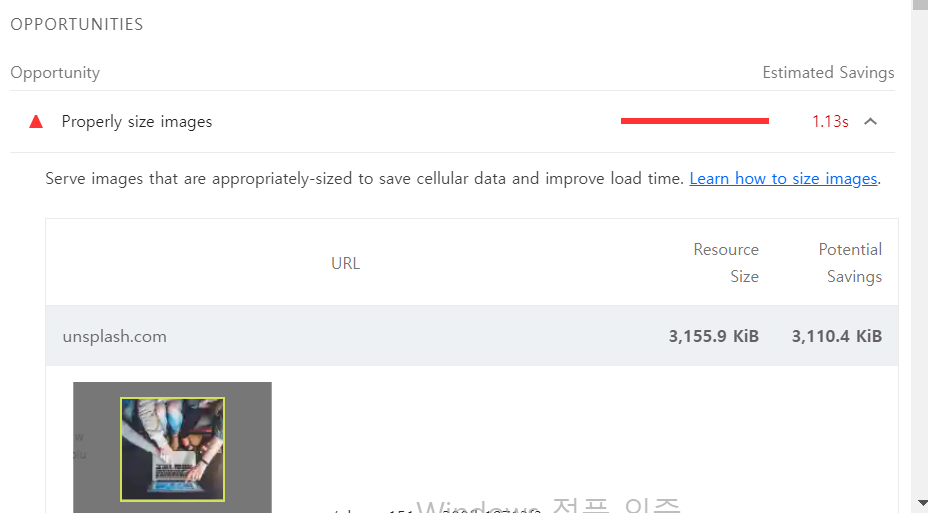

# 이미지 사이즈 최적화

### 이미지 사이즈 최적화란

이미지 가로, 세로 사이즈를 줄여 이미지 용량을 줄이고 그만큼 더 빠르게 다운로드 하는 기법

### 크롬 분석 툴 Lighthouse에서 이미지 최적화 제안



- 이는 이미지를 적절한 사이즈로 사용하도록 제안

* 이미지를 적절한 사이즈로 변경하면 용량을 대략 3000KiB정도 줄일 수 있고, 이로써 이미지 로드에 소용되는 시간을 1.13초 단축할 수 있다고 함.


- 위 내용을 보면 실제 이미지 사이즈는 1200\*1200px인데, 화면에 그려지는 이미지의 사이즈는 120\*120px라고 한다.
- 처음부터 120\*120px에 맞는 이미지를 사용하라는 뜻!

* 요즘 사용되는 레티나 디스플레이 같은 공간(픽셀)에 더 많은 픽셀을 그릴 수 있기 때문에, <span style='background-color: #fff51b; color: black;'>**너비 기준 두배 정도 큰 이미지를 사용하는 것이 적절**</span>, 즉 240\*240사이즈 사용

#### CDN에서 로드 된 경우 url에 이미지 크기 조정하는 옵션이 있어, 쉽게 이미지 사이즈 조절 가능

## 서버에 저장되어 있는 정적 이미지 최적화

### 이미지 포맷 종류

#### 비트맵 이미지 포맷 중 대표적 3가지

##### PNG

- 무손실 압축 방식, 원본을 훼손 없이 압축
- 알파 채널을 지원하는 이미지 포맷
  - 알파 채널 : 투명도
  * PNG포맷으로 배경 색을 투명하게 하여 뒤에 있는 요소가 보이는 이미지 만들 수 있다.

##### JPG(JPEG)

- 압축 과정에서 정보 손실 발생
- 하지만 그만큼 이미지를 더 작은 사이즈로 줄일 수 있다.
- 그래서 일반적으로 웹에서 이미지를 사용할 때는 _고화질이어야 하거나 투명도 정보가 필요한게 아니라면_ JPG 사용

##### WebP

- 무손실 압축과 손실 압축을 모두 제공하는 최신 이미지 포맷
- PNG나 JPG에 비해서 대단히 효율적으로 이미지를 압축할 수 있다.
  - PNG 대비 26%, JPG 대비 25~34% 더 나은 효율을 가지고 있다고 한다.

* 최신 이미지 파일 포맷이라서 지원하지 않는 브라우저도 있음

##### 정리

- 사이즈 : PNG > JPG > WebP
- 화질 : PNG = WebP > JPG
- 호환성 : PNG = JPG > WebP

### Squoosh를 사용하여 이미지 변환

#### Squoosh란?

구글에서 만든 이미지 컨버터 웹 애플리케이션


- 압축 방식 WebP, 압축률 75로 변경

* compress 섹션의 압축률(Quality) : 이 값이 너무 작으면 화질이 많이 떨어지고, 너무 크면 용량이 커지므로 70~80 정도를 권장

### picture 태그를 사용하여 다양한 이미지 타입 렌더링

- WebP로만 이미지를 렌더링할 경우 특정 브라우저에서 제대로 렌더링되지 않을 수 있다. => 이런 문제 해결을 위해 picture 태그를 이용
- **picture 태그 : 다양한 타입의 이미지를 렌더링하는 컨테이너로 사용됨.**

#### 뷰포트에 따라 구분

```html
<picture>
  <source media="(min-width: 650px)" srcset="img_pink_flowers.jpg" />
  <source media="(min-width: 465px)" srcset="img_white_flowers.jpg" />
  
</picture>
```

#### 이미지 포맷에 따라 구분

```html
<picture>
  <source srcset="photo.avif" type="image/avif" />
  <source srcset="photo.webp" type="image/webp" />
  
</picture>
```

### 예제 프로젝트에 이미지 최적화 적용

- Squoosh에서 JPG => WebP로 변환
  - width,heigth : 600
  - 포맷 WebP
- picture 태그 이용
- WebP를 지원하지 않는 브라우저를 위해 JPG 원본 이미지도 Squoosh에서 변환
  - width, height : 600

* Main.js

```javascript
import main1 from "../assets/main1.jpg";
import main2 from "../assets/main2.jpg";
import main3 from "../assets/main3.jpg";
....
import main1_webp from "../assets/main1.webp";
import main2_webp from "../assets/main2.webp";
import main3_webp from "../assets/main3.webp";

function MainPage(props) {
    ...
 <ThreeColumns
          columns={[
            <Card image={main1} webp={main1_webp}>
              롱보드는 아주 재밌습니다.
            </Card>,
            <Card image={main2} webp={main2_webp}>
              롱보드를 타면 아주 신납니다.
            </Card>,
            <Card image={main3} webp={main3_webp}>
              롱보드는 굉장히 재밌습니다.
            </Card>,
          ]}
        />
   ...
}
```

- Card.jsx
  - 이미지 지연로딩을 위해 바로 srcset에 값을 넣지 않고 data-srcset에 값을 추가

```javascript
import React, { useRef } from "react";
import { useEffect } from "react";

function Card(props) {
  const imgRef = useRef(null);

  useEffect(() => {
    const options = {};
    const callback = (entries, observer) => {
      entries.forEach((entry) => {
        if (!entry.isIntersecting) return;
        const target = entry.target;
        const sourceEl = target.previousSibling;

        target.src = entry.target.dataset.src;
        sourceEl.srcset = sourceEl.dataset.srcset;
        observer.unobserve(entry.target);
      });
    };
    const observer = new IntersectionObserver(callback, options);
    observer.observe(imgRef.current);

    return () => observer.disconnect();
  }, []);

  return (
    <div className="Card text-center">
      <picture>
        <source data-srcset={props.webp} type="image/webp" />
        
      </picture>

      <div className="p-5 font-semibold text-gray-700 text-xl md:text-lg lg:text-xl keep-all">
        {props.children}
      </div>
    </div>
  );
}

export default Card;
```

#### 최적화 전후 비교

- 이미지 최적화 전
  

- 이미지 최적화 후
  
