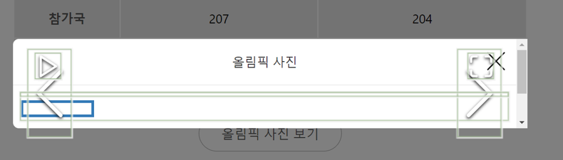
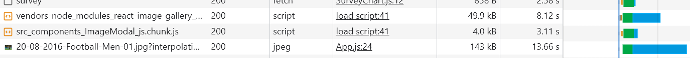
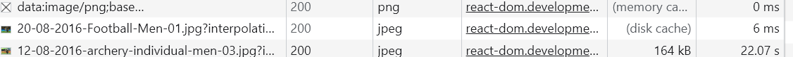

# 이미지 사전 로딩

### 느린 이미지 로딩



- 위와 같은 현상은 이미지가 제때 뜨지 않아 생기는 현상
- 모달을 띄우고 그 안에 이미지를 로드하려고 하는데, 이미지의 사이즈가 크다 보니 다운로드 시간이 오래 걸려서
  다운르도 완료될 때까지 아무것도 뜨지 않는 것

### 이미지 사전 로딩

- 이미지가 화면에 제때 뜰 수 있도록 미리 다운로드하는 기법

* 컴포넌트는 import 함수를 이용하여 로드했는 데, 이미지는 이미지가 화면에 그려지는 시점, **즉 HTML 또는 CSS에서 이미지를 사용하는 시점**에 로드됨.
* 이런 경우 외에 **자바스크립트로 이미지를 직접 로드**하는 방법이 한가지 있다. => **Image 객체를 사용하는 방법**
  ```javascript
  const img = new Image();
  img.src = "{이미지 주소}";
  ```

#### 실제 예제 코드에 적용

- **사전 로드할 이미지는 모달에서 가장 먼저 보이는 이미지로 넣어준다.**

```javascript
function App() {
  const [showModal, setShowModal] = useState(false);

  useEffect(() => {
    const component = import("./components/ImageModal");

    const img = new Image();
    img.src =
      "https://stillmed.olympic.org/media/Photos/2016/08/20/part-1/20-08-2016-Football-Men-01.jpg?interpolation=lanczos-none&resize=*:800";
  }, []);

  return <div className="App">...</div>;
}
```



- 위와 같이 추가하고 페이지 로드되는 과정을 Network 패널에서 확인해보면, 모달 코드와 함께 이미지가 다운로드되는 것을 볼 수 있다.

* 즉, **나중에 모달 위에 표시될 대표 이미지를 미리 다운로드한 것**

* 위와 같이하면 모달을 열면, 모달이 뜨자마자 대표 이미지가 바로 보임
  

- 모달을 열고 Network 패널을 보면 사전 로드한 이미지의 [Size]항목에 **disk cache**라고 적혀 있고, 다운로드 시간 매우 짧다.
  - 왜냐면, 페이지 로드가 된 후 이미지를 사전 로드해 뒀기 때문

### 추가적 고민 사항

- 몇 장의 이미지까지 사전 로딩 해둘 것인 가
- 모달의 첫 화면으로 보이는 이미지는 대표 이미지뿐만 아니라 섬네일 이미지도 있을 수 있다.
  - 이미지 갤러리 모달이라고 생각하면 큰 이미지 밑에 작은 다른이미지(섬네일)
- 섬네일 이미지까지 사전 로딩을 하게 되면 페이지가 로드될 때, 브라우저의 리소스를 그만큼 많이 사용하기 때문에 다른 성능 문제를 야기할 수도 있다.
- 따라서 **어떤 컨텐츠를 사전 로드할 때는 정말 사전 로딩이 필요한 지 고민해야 한다.**
