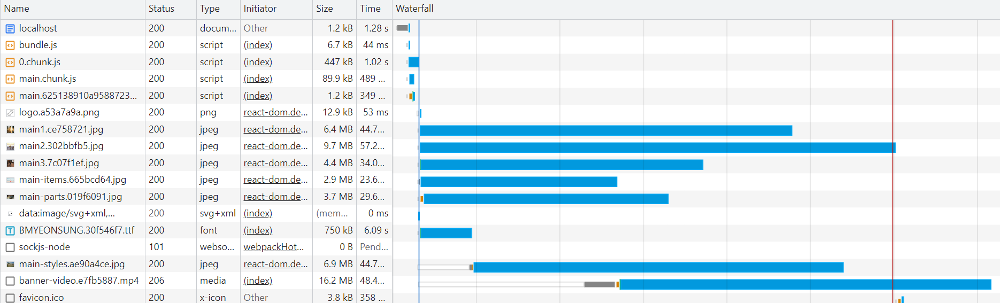
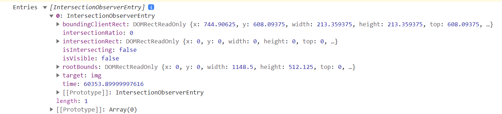

# 이미지 지연 로딩



- 위 이미지에서 보면 bundle파일과 다음으로 main, 이미지와 폰트가 다운로드 됨.
- 그리고 한동안 banner-video 파일이 pending 상태(하얀 막대)로 존재하다가 일부 리소스(main-items.jpg)의 다운로드가 완료된 후에야 다운로드되는 것을 볼 수 있다.
- **banner-video는 페이지에서 가장 처음으로 사용자에게 보이는 콘텐츠임. 가장 나중에 로드되면, 사용자 경험에 좋지 않다.**

### 위와 같은 상황 어떻게 해결 ?

- 동영상 다운로드를 방해하는, **당장 사용되지 않는 이미지를 나중에 다운로드 되도록** 해서 동영상이 먼저 다운로드 되게 하는 것 => **이미지 지연 로드**

* 그럼 이런 이미지들 언제 로드해야할까 ?
  - 뷰포트에 이미지가 표시될 위치까지 스크롤되었을 때 이미지를 로드할지 말지 판단 가능

## Intersection Observer

```javascript
const options = {
  root: null,
  rootMargin: "0px",
  threshold: 1.0,
};

const callback = (entries, observer) => {
  console.log("Entries", entries);
};

const observer = new IntersectionObserver(callback, options);

observer.observe(document.querySelector("#target-element1"));
observer.observe(document.querySelector("#target-element2"));
```

- options
  - root : 대상 객체의 가시성을 확일할 때 사용되는 뷰포트 요소, default는 null로 null 설정 시 브라우저의 뷰포트로 설정
  * rootMargin : root 요소의 여백, root의 가시 범위를 가상으로 확장하거나 축소 할 수 있다.
  * threshold : 가시성 퍼센티지, 대상 요소가 어느 정도 보일 때 콜백을 실행할지 결정, 1.0이면 대상 요소가 모두 보일 때 콜백 실행, 0으로 설정하면 1px라도 보이는 경우 콜백이 실행

* callback
  - 첫번째 인자(entries) : 가시성이 변한 요소를 배열 형태로 전달

## 예제 프로젝트에 적용

### IntersectionObserver 적용 전

    ```javascript
    function Card(props) {
        return (
            <div className="Card text-center">
                
                <div className="p-5 font-semibold text-gray-700 text-xl md:text-lg lg:text-xl keep-all">
                    {props.children}
                </div>
            </div>
        );
    }
    ```

### IntersectionObserver 적용 후

```javascript
function Card(props) {
  const imgRef = useRef(null);

  useEffect(() => {
    const options = {};
    const callback = (entries, observer) => {
      console.log("Entries", entries);
    };
    const observer = new IntersectionObserver(callback, options);
    observer.observe(imgRef.current);

    return () => observer.disconnect();
  }, []);

  return (
    <div className="Card text-center">
      
      <div className="p-5 font-semibold text-gray-700 text-xl md:text-lg lg:text-xl keep-all">
        {props.children}
      </div>
    </div>
  );
}
```

- 렌더링할 때 마다 인스턴스 생성이 안되도록 useEffect 내부에에서 observer 생성
- 생성된 인스턴스 정리를 위해 useEffect return 문에 observer.disconnect 함수 호출

#### isIntersecting

- console.log 내용
  
  - 가장 중요한 값인 **isIntersecting** : 해당 요소가 뷰포트 내에 들어왔는지 여부

* 화면에 이미지가 보이는 순간, 즉 콜백이 실행되는 순간에 이미지를 로드
* **이미지 로딩은 img 태그에 src가 할당되는 순간 일어남**

- 따라서 <span style='background-color : #fff5b1; color:black;'>**최초에 img 태그에 src값을 할당하지 않다가, 콜백이 실행되는 순간 할당함으로써 이미지 지연 로딩을 적용**</span>
  - img태그에 src 대신 data-src에 주소 넣음

```javascript
function Card(props) {
  const imgRef = useRef(null);

  useEffect(() => {
    const options = {};
    const callback = (entries, observer) => {
      entries.forEach((entry) => {
        if (!entry.isIntersecting) return;
        console.log("is intersecting", entry.target.dataset.src);
        entry.target.src = entry.target.dataset.src;
        observer.unobserve(entry.target);
      });
    };
    const observer = new IntersectionObserver(callback, options);
    observer.observe(imgRef.current);

    return () => observer.disconnect();
  }, []);

  return (
    <div className="Card text-center">
      
      <div className="p-5 font-semibold text-gray-700 text-xl md:text-lg lg:text-xl keep-all">
        {props.children}
      </div>
    </div>
  );
}
```

- observer.unobserver : 한 번 이미지를 로드한 후에는 다시 호출할 필요가 없으므로 해제하기 위해

## react-lazyload

- Intersection Observer API와 동일한 기능을 지원하는 라이브러리

```
npm install --save react-lazyload
```

```js
import LazyLoad from "react-lazyload";

function Component() {
  return (
    <div>
      <LazyLoad offset={1000}>
        
      </LazyLoad>
    </div>
  );
}
```

- 이렇게 코드를 작성하면 LazyLoad의 자식으로 들어간 요소들은 화면에 표시되기 전까지는 렌더링되지 않다가 스크롤을 통해 화면에 들어오는 순간 로드됨.

* 이미지뿐만 아니라 일반컴포넌트도 이 안에 넣어 지연로드 가능
* Intersection Observer API를 이용해도 컴포넌트 지연 로드를 할 수 있지만 그걸 직접 구현하는 데는 시간이 많이 필요할 거임
* offset 옵션을 이용하여 얼마나 미리 이미지를 로드할지 픽셀 값으로 넣어 준다.
  - 이미지가 지연로드되기 때문에 초기화면의 리소스를 절약할 수 있는 것은 좋으나, 스크롤을 내려 화면에 이미지가 들어올 때 로드하기 때문에 처음에는 이미지가 보이지 않고 시간이 지나야 이미지가 보인다. 이런 문제를 offset옵션으로 해결
  * offset을 100으로 설정하면 화면에 들어오기 100px전에 이미지를 로드하는 식
