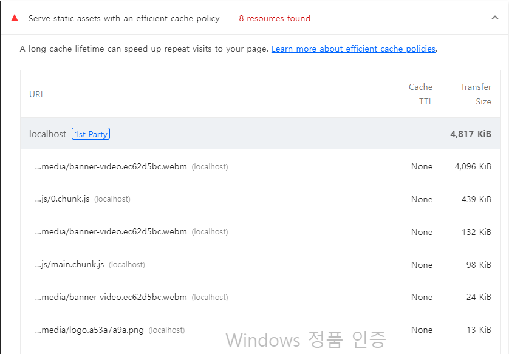

# 캐시 최적화



- 이 항목은 네트워크를 통해 다운로드하는 리소스에 캐시를 적용하라는 의미

* Networtk 패널에서 위 리소스 중 하나를 확인해보면 응답 헤더에 캐시에 대한 설정인 Cache-Control이라는 헤더가 없는 것을 알 수 있음.
  - 즉, npm run start로 실행한 서버에는 캐시 설정이 제대로 되어있지 않은 상태

## 캐시란?

- 자주 사용하는 데이터나 값을 미리 복사해 둔 임시 저장 공간 또는 저장하는 동작
- 웹에서는 서비스에서 사용하는 이미지나 자바스크립트 파일을 매번 네트워크를 통해 불러오지 않고 최초에만 다운로드하여 캐시에 저장해 두고 그 이후 요청 시에는 저장해 둔 파일을 사용한다.

### 캐시의 종류

1. 메모리 캐시 : 메모리에 저장하는 방식, 메모리는 RAM을 의미
   - Network 패널 Size항목에 memory cache
2. 디스트 캐시 : 파일 형태로 디스크에 저장하는 방식
   - Network 패널 Size항목에 disk cache

- 어떤 캐시를 사용할지 직접 제어 불가, 브라우저가 사용 빈도나 파일 크기에 따라 특정 알고리즘에 의해 알아서 처리함.

### Cache-Control

- 브라우저가 캐시를 하기 위해서 Cache-Control이라는 헤더가 응답 헤더에 있어야 함.
- 이 헤더를 통해 캐시를 어떻게, 얼마나 적용해야 하는 지 판단
  > - no-cache : 캐시를 사용하기 전 서버에 검사 후 사용
  > - no-store : 캐시 사용 안 함
  > - public : 모든 환경에서 캐시 사용 가능
  > - private : 브라우저 환경에서만 캐시 사용, 외부 캐시 서버에서는 사용 불가
  > - max-age : 캐시의 유효 시간

* public과 private로 설정하면 max-age에서 설정한 시간만큼은 서버에 사용 가능 여부를 묻지 않고 캐시된 리소스 바로 사용. 유효 시간이 지났다면 서버에 캐시된 리소스를 사용해도 되는지 다시 체크하고 유효 시간만큼 더 사용
* public과 private의 차이 : 캐시 환경의 차이
  - 웹 리소스는 브라우저뿐만 아니라 웹 서버와 브라우저 사이를 연결하는 중간 캐시 서버에서도 캐시될 수 있다.
  - 만약 중간 서버에서 캐시를 적용하고 싶지 않다면 private 옵션 사용
* max-age=0 설정은 매번 서버에 캐시를 사용해도 되는지 확인 => no-cache랑 동일한 설정

#### 캐시된 리소스와 서버의 최신 리소스가 같은지 다른지 어떻게 체크?

- 서버에서 캐시된 리소스의 응답 헤더에 있는 Etag값과 서버에 있는 최신 리소스의 Etag 값을 비교해서 판단.
- 만약 서버에 있는 리소스가 변했다면 Etag값이 달라지고, 서버는 새로운 Etag 값과 함께 최신 리소스를 브라우저로 다시 보내 준다.

* 변경되지 않았을 경우 304상태 코드를 응답으로 보낸다.

#### 적절한 캐시 유효 시간

- 일반적으로 HTML 파일에는 no-cache 설정, 항상 최신 버전읜 웹 서비스를 제공하기 위해
  - HTML이 캐시되면 캐시된 HTML에서 이전 버전의 JS나 CSS를 로드하게 되므로 캐시 기간 동안 최신 버전의 웹 서비스를 제공하지 못함
- 빌드된 JS와 CSS는 파일명에 해시를 함께 가지고 있다. 즉, 코드가 변경되면 해시도 변경되어 완전히 다른 파일이 되어 버림.
  - 캐시를 아무리 오래 적용해도 HTML만 최신 상태라면 JS나 CSS 파일은 당연히 최신 리소스 로드
  - 이미지도 마찬가지

* **리소스 종류별 캐시 설정**

  - 31536000 : 1년을 의미, 사실상 반영구적인 기간

    > - HTML : no-cache
    > - JS : public, max-age:31536000
    > - CSS : public, max-age:31536000
    > - IMG : public, max-age:31536000

    ```js
    const header = {
      setHeaders: (res, path) => {
        if (path.endsWith(".html")) {
          res.setHeader("Cache-Control", "no-cache");
        } else if (
          path.endsWith(".js") ||
          path.endsWith(".css") ||
          path.endsWith(".webp")
        ) {
          res.setHeader("Cache-Control", "public, max-age=31536000");
        } else {
          res.setHeader("Cache-Control", "no-store");
        }
      },
    };
    ```
