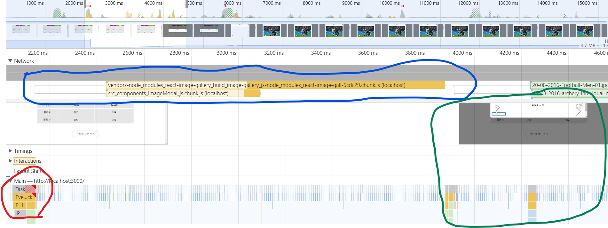
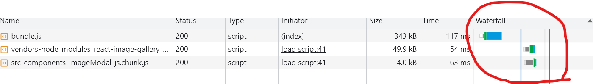

# 컴포넌트 사전 로딩

## 컴포넌트 지연로딩의 단점

- 초기 화면 로딩에는 효과적일지 몰라도, 모달과 같은 컴포넌트를 띄우는 시전에는 한계가 있다.
  - 모달 코드를 분리했기 때문에 모달을 띄울 때 네트워크를 통해 모달 코드를 새로 로드해야 하며 로드가 완료되어야만 모달을 띄울 수 있다.
  - **즉, 모달이 뜨기까지 약간의 지연이 발생할 수 있다.**
    

* Performance 패널에서 Network throttling Fast 3G로 설정한 후, 기록
  > - 빨간색 : 모달 열기버튼 클릭
  > - 파란색 : 모단 컴포넌트 로드
  > - 초록색 : 모달 노출
* 위 이미지를 보면 클릭 시점과 모달이 뜨는 시점이 크게 차이 남.

#### 이러한 단점을 해결하기 위해 사전 로딩(Preloading)기법을 이용하면 된다.

## 사전 로딩이란

- **필요한 모듈이 필요해지기 전에 미리 로드하는 기법**
- 예를 들어, 위와 같은 상황에서 모달 코드가 필요한 시점은 사용자가 버튼을 클릭하는 시점
- 하지만, 만약 사용자가 버튼을 클릭하기 전에 미리 모달 코드를 로드해두면 ?
  - 네트워크를 통해 코드를 불러오는 시간과 준비하는 데 드는 시간을 단출할 수 있어 빠르게 모달을 띄울 수 있을 것.

* **이 방법에는 한가지 문제가 있다. 사용자가 언제 버튼을 클릭할 지 모르니 모달 코드를 언제 미리 로드해 둘지 정하기 애매**

## 컴포넌트 사전 로딩 타이밍

1. 사용자가 버튼 위에 마우스를 올려놨을 때 => mouseenter
2. 최초에 페이지가 로드되고 모든 컴포넌트의 마운트가 끝났을 때

### 1. 마우스 커서를 버튼에 올려놓는다.

- onMouseEnter 이벤트로 모달을 로드하는 이벤트함수 등록

* 버튼을 클랙할 때, 마우스 커서를 버튼 위에 올리고 클릭하기 대략 300~600밀리초 정도 시간 차가 있다. 아주 찰나의 순간이긴 하지만 브라우저가 새로운 파일을 로드하기에 충분

```
import React, { lazy, useState, Suspense } from "react";
...
// import ImageModal from './components/ImageModal'

const LazyImageModal = lazy(() => import("./components/ImageModal"));

function App() {
  const [showModal, setShowModal] = useState(false);

  const handleMouseEnter = () => {
    const component = import("./components/ImageModal");
  };

  return (
    <div className="App">
     ...
      <ButtonModal
        onClick={() => {
          setShowModal(true);
        }}
        onMouseEnter={handleMouseEnter}
      >
        올림픽 사진 보기
      </ButtonModal>
      ...
      <Suspense fallback={null}>
        {showModal ? (
          <LazyImageModal
            closeModal={() => {
              setShowModal(false);
            }}
          />
        ) : null}
      </Suspense>
    </div>
  );
}

```

### 2. 컴포넌트의 마운트 완료 후 사전 로딩

- 만약에 **모달 컴포넌트 크기가 커서 로드하는 데 1초 또는 그 이상의 시간이 필요할 수도 있다.**
- 이런 경우 모든 컴포넌트의 마운트가 완료된 후, **브라우저가 여유가 생겼을 때 뒤이어 모달을 추가로 로드하는 것**

* 클래스형 컴포넌트라면 **componentDidMount** 시점
* 함수형 컴포넌트라면 **useEffect**시점

```

function App() {
  const [showModal, setShowModal] = useState(false);

  useEffect(() => {
    const component = import("./components/ImageModal");
  }, []);

  return (
    <div className="App">
      ...
      <ButtonModal
        onClick={() => {
          setShowModal(true);
        }}
      >
        올림픽 사진 보기
      </ButtonModal>
      ...
      <Suspense fallback={null}>
        {showModal ? (
          <LazyImageModal
            closeModal={() => {
              setShowModal(false);
            }}
          />
        ) : null}
      </Suspense>
    </div>
  );
}
```



- 모달에 대한 js파일이 바로 로드되기는 하지만, 위 이미지의 Waterfull에서 타임라인을 보면 초기 페이지 로드에 필요한 파일을 우선 다운로드
- 페이지 로드가 완료된 후에 모달 코드를 다운로드하고 있다.

이 두가지 방법만 있는 것은 아니다. 서비스나 기능의 특성에 따라 다양한 방법으로 적용할 수 있다.

#### 중요한 것은 어느 타이밍에 사전 로드하는 것이 해당 서비스에 합리적인 지 판단하는 것
