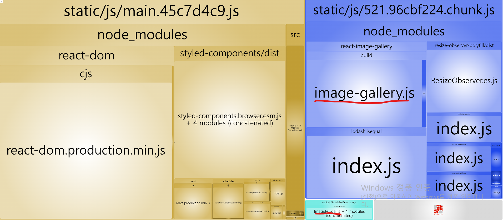

# 컴포넌트 지연 로딩

## 번들 파일 분석

```
npm install --save-dev cra-bundle-analyzer
npx cra-bundle-analyzer
```


- 2.chunk.js 내에 react-image-gallery라이브러리는 예제 프로젝에서 첫 화면부터 필요하지 않음.
- 이 라이브러리가 필요한 시점은 사진 갤러리가 있는 모달 창을 띄울 때.
- 큰 용량은 아니지만, 조금이라도 효율적으로 사용하기 위해 이 라이브러리의 코드를 분할하고 지연 로딩 적용

## 모달 코드 분리

- react-image-gallery 라이브러리만 분할하지 않고, 모달 컴포넌트 자체도 첫 페이지 로딩 시 바로 필요한 코드가 아니므로 함께 묶어서 분할

```
import React, { lazy, useState } from "react";
...
// import ImageModal from './components/ImageModal'

const LazyImageModal = lazy(() => import("./components/ImageModal"));

function App() {
  const [showModal, setShowModal] = useState(false);

  return (
    <div className="App">
      ...
      <Suspense fallback={null}>
        {showModal ? (
          <LazyImageModal
            closeModal={() => {
              setShowModal(false);
            }}
          />
        ) : null}
      </Suspense>
    </div>
  );
}
```

### 지연 로딩 코드 수정 후

#### Network 패널

- 모달 창 클릭 전


- 모달 창 클릭 후


- ImageModal 컴포넌트와 react-image-gallery 라이브러리 파일 두 개 로드되는 걸 볼 수 있다.

#### 번들 파일 분석



- 위 이미지 처럼 파란색, 하늘색 블록으로 컴포넌트가 분리된 것을 볼 수 있다.
- **한 가지 특이한 점은 react-image-gallery만 분할될 것이라 생각했는 데, react-image-gallery에서 참조하고 있는 모든 라이브러리가 함께 묶여 분할되었다는 점** 그래서 기대했던 용량보다 많은 용량이 분할되었음.
