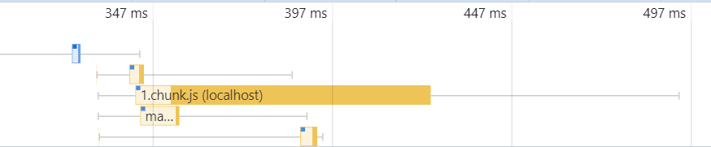
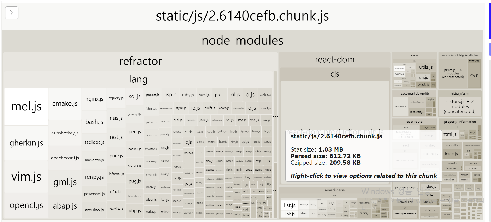
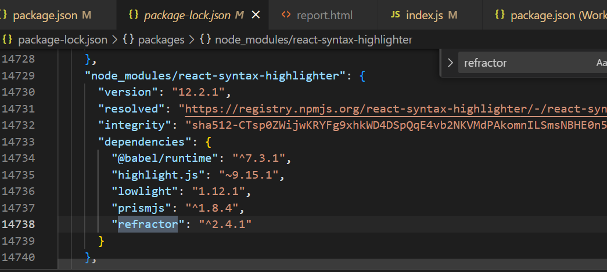
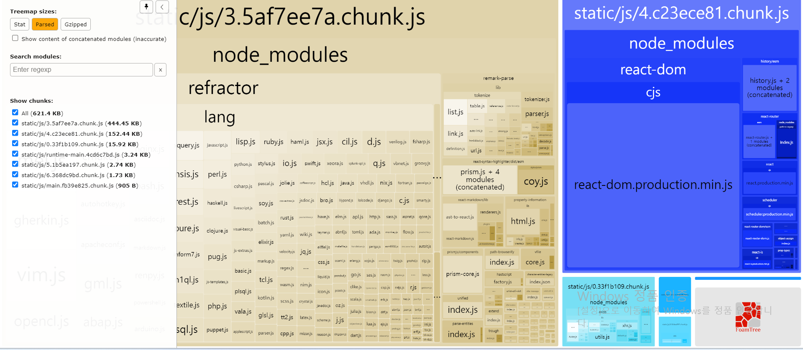
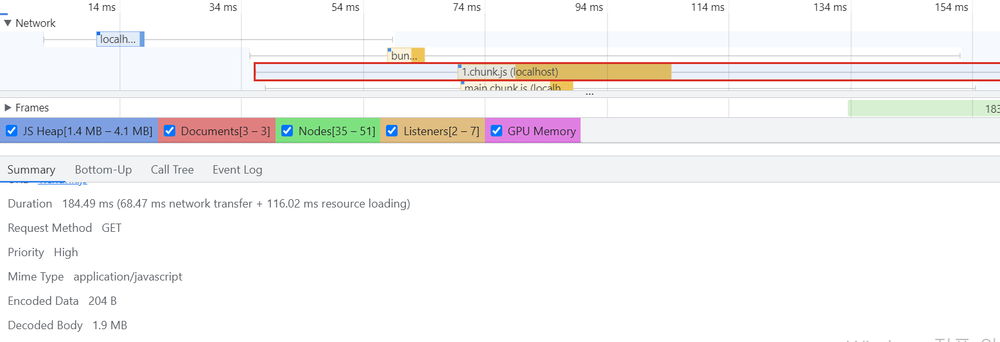

# 코드 분할 & 지연 로딩

- webpack을 통해 번들링된 파일을 분석하고 최적화
  
- chunk.js가 유난히 크고 다운로드 오래 걸리는 파일

* 이를 위해 webpack bundle analyze라는 툴 이용
  - 이 툴을 사용하려면 webpack 설정 직접 수정
  * 그러나 create react app으로 생성해서 설정이 숨겨져 있음
  * eject 없이 사용할 수 있는 **cra-bundle-analyzer** 사용.

### cra-bundle-analyzer 실행

```
npx cra-bundle-analyzer
```

- build 폴더에 report.html 생성됨. 이거를 open width live server로 실행했음
  

* 2.6~chunk.js 파일이 가장 많은 부분 차지하는 걸 볼 수 있다.
* 이 내부에는 refractor과 react-dom이 매우 큰 비중 차지
* react-dom은 리액트를 위한 코드이므로 생략하고, refractor 패키지의 출처를 확인해보자.
  - package-lock.json에서 ctrl+f로 refractor 패키지 검색
    
  * react-syntax-highlighter : 마크다운의 코드 블록에 스타일을 입히는 데 사용되는 라이브러리
    - 예제 프로젝트에서 블로그 글의 상세 페이지에서 사용되는 라이브러리
    - 글 목록 페이지에는 필요가 없다.
* 사용자가 처음 진입하는 목록 페이지에는 해당 라이브러리를 굳이 다운로드할 필요가 없음.
* 그래서 **하나로 합쳐져 있는 이 번들 파일을 페이지별로 필요한 내용만 분리가 필요** => 코드 분할

## 코드 분할이란

- 코드를 분할하는 기법으로 하나의 번들 파일을 여러 개의 파일로 조개는 방법

* **분할된 코드는 사용자가 서비스를 이용하는 중 해당 코드가 필요해지는 시점에 로드되어 실행됨. => 지연로딩**

### 코드 분할의 여러가지 패턴

#### 페이지 별

- 페이지 별로 코드를 분할

#### 모듈별

- 각 페이지가 공통으로 사용하는 모듈이 많고 그 사이즈가 큰 경우

### 코드 분할 적용하기

#### 동적 import 사용

- 아래와 같이 했을 경우 해당 모듈은 빌드 시에 함께 번들링 된다.

  ```
  import { add } from './math';

  console.log(add(1, 4));
  ```

- 아래와 같이 할 경우 빌드때가 아닌 런타임에 해당 모듈을 로드한다.
  이를 **동적 import**라고 함.

  ```
    import('add').then((module) => {
      const { add } = module;
      console.log(add(1, 4));
    })
  ```

- **웹팩은 이 동적 import문을 만나면 코드를 분할하여 번들링한다.**

* 위 방식의 문제점은 Promise형태로 모듈을 반환해주어 컴포넌트를 import해야하는 경우 Promise 밖으로 빼내야 함.
* 리액트에서는 lazy와 suspense를 제공하여 이를 해결함.

```
import React, {Suspense} from 'react';

const SomeComponent = React.lazy(() => import('./SomeComponent'));

function MyComponent() {
  return <Suspense fallback={<div> 로딩중 </div>}>
    <SomeComponent />
  </Suspense>
}
```

#### 실제 예제 코드에 해당 기법 적용

- 상단에 주석된 import는 기존 코드
- 아래 lazy로 불러온다. switch문을 Suspense로 감쌈.

```
import React, { Suspense } from "react";
import { Switch, Route } from "react-router-dom";
import "./App.css";
// import ListPage from './pages/ListPage/index'
// import ViewPage from './pages/ViewPage/index'

const ListPage = React.lazy(() => import("./pages/ListPage/index"));
const ViewPage = React.lazy(() => import("./pages/ViewPage/index"));

function App() {
  return (
    <div className="App">
      <Suspense fallback={<div>로딩중</div>}>
        <Switch>
          <Route path="/" component={ListPage} exact />
          <Route path="/view/:id" component={ViewPage} exact />
        </Switch>
      </Suspense>
    </div>
  );
}

export default App;

```



- 0.chunk.js, 3.chunk.js, 4.chunk.js, 5.chunk.js, 6.chunk.js 많은 번들파일로 쪼개진 걸 볼 수 있음



- 코드 분할 후, 파일 크기도 4.2MB에서 1.9MB로 줄고 시간초도 줄어든 것을 볼 수 있다.
