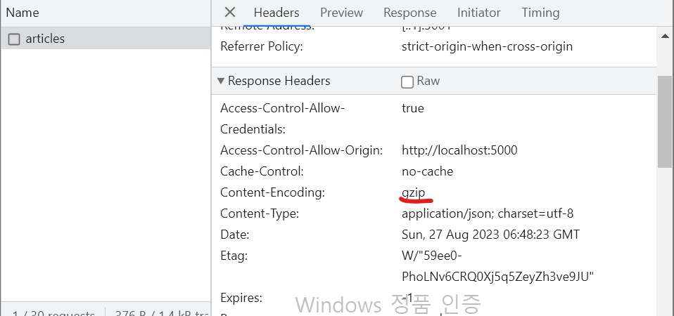

# 텍스트 압축

- 웹에서 텍스트를 압축할 때 Gzip과 Deflate라는 두 가지 방식을 사용함
- 단일 서버가 아닌 여러 서버를 사용하고 있다면, Nginx와 같은 게이트웨이 서버에서 공통적으로 텍스트 압축을 적용할 수도 있음
- 예제 프로젝트에선 serve 라이브러리 사용

#### serve 라이브러리

- 특정 파일 또는 폴더를 간단하게 웹에서 서비스할 수 있게 돕는 라이브러리
  - -s : SPA 서비스를 위해 매칭되지 않는 주소는 모두 index.html로 보내겠다는 옵션

```
"scripts": {

    "serve": "npm run build && node ./node_modules/serve/bin/serve.js  -s build",

  },
```

### 텍스트 압축이란

- 웹 페이지를 로드할 때 다양한 리소스를 다운로드함. HTML,CSS, 자바스크립트와 같은 텍스트 형태의 파일.
- 기본적으로 HTML,CSS, 자바스크립트는 텍스트 기반의 파일이기 때문에 텍스트 압축 기법 적용 가능.

#### 압축 여부 확인

- HTTP의 헤더를 살펴보면 됨.
- 응답 헤더에 **Content-Encoding**가 gzip이라는 방식으로 압축되어 전송되었다는 의미
  
