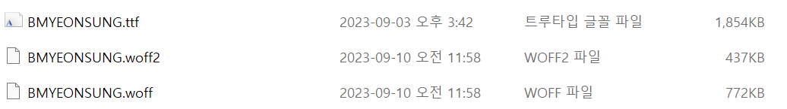

# 폰트 최적화

## FOUT / FOIT


- 위 이미지처럼 폰터가 변하는 걸 볼 수 있다.
- 이 현상은 폰트 다운로드가 완료되지 않아서 생기는 현상이다.

* 폰트의 변화로 발생하는 이 현상을 <span style='background-color : #fff51d; color:black;'>FOUT(Flash of Unstyled Text) 또는 FOIT(Flash of Invisible Text)</span>라고 한다.

#### FOUT

- Edge 브라우저에서 폰트를 로드하는 방식

* 폰트의 다운로드 여부와 상관없이 먼저 텍스트를 보여준다.
* 폰트가 다운로드되면 그때 폰트를 적용하는 방식

#### FOIT

- 크롬, 사파리, 파이어폭스 등에서 폰트를 로드하는 방식
- 폰트가 완전히 다운로드되기 전까지 텍스트 자체를 보여 주지 않는다.

* 폰트 다운로드가 완료되면 폰트가 적용된 텍스트를 보여줌
* 그러나 위에 이미지에서보면 크롬에서 테스트한 것인 데, 폰트가 제대로 다운로드되지 않았는 데 텍스트가 보임
* 그 이유는 완전한 FOIT가 아니라 <span style='background-color : #fff51d; color:black;'>크롬은 3초만 기다리는 FOIT이기 때문</span>
  - 즉, 3초 동안은 폰트가 다운로드되기를 기다리다가, 3초가 지나도 다운로드되지 않으면 기본 폰트로 텍스트를 보여줌.

#### 상황에 따라 FOUT가 좋을 때가 있고, FOIT가 좋을 때가 있다.

    * 중요한 텍스트(뉴스 제목 등)의 경우 FOIT 방식으로 폰트를 적용하면 텍스트 내용이 사용자에게 빠르게 전달되지 않을 것임.
    * 사용자에게 꼭 전달하지 않아도 되는 텍스트의 경우 FOUT 방식으로 인한 폰트 변화는 사용자의 시선을 분산시킬 수 있음

## 폰트 최적화 방법

- 크게 두가지가 있다.
  1. 폰트 적용 시점을 제어하는 방법
  2. 폰트 사이즈를 줄이는 방법

### 1. 폰트 적용 시점 제어하기

- 위에서 상황에 따라 FOUT/FOIT가 좋을 때가 있다고 했다.
- 따라서 서비스 또는 콘텐츠의 특성에 맞게 적절한 방식 적용해야 함.
- **CSS의 font-display 속성을 이용하면 폰트가 적용되는 시점을 제어할 수 있음.**

#### font-display

- @font-face에서 설정할 수 있고 다음 값을 가짐
  > - auto : 브라우저 기본 동작(기본 값)
  > - block : FOIT (timeout = 3s)
  > - swap : FOUT
  > - fallback : FOIT (timeout = 0.1s) //3초 후에도 불러오지 못한 경우 기본 폰트로 유지, 이후 캐시
  > - optional : FOIT (timeout = 0.1s) // 이후 네트워크 상태에 따라 기본 폰트로 유지할지 결정, 이후 캐시

* fallback : 3초 이후에도 폰트를 다운로드 하지 못한 경우, 이후에 폰트가 다운로드되더라도 폰트를 적용하지 않고 캐시에 둠.
  - 결국 최초 페이지 로드에서 폰트가 늦게 다운로드되면 폰트가 적용되지 않은 모습이 보인다.
  - 하지만 페이지 리로드 시 캐시에 폰트가 있으므로 바로 폰트가 적용된 텍스트 볼 수 있음
* optional : 3초가 아니라 사용자의 네트워크 상태를 기준으로 폰트를 적용할지 기본 폰트로 유지할지 결정

```CSS
@font-face {
    font-family : BMYEONSUNG;
    src : url('./assets/fonts/BMYEONSUNG.ttf');
    font-display: fallback;
}
```

- **fontfaceobserver :** <span style='background-color : #fff51d; color:black;'>폰트가 완료되는 시점을 아는 데 도움을 주는 라이브러리</span>
  ```
  npm install --save fontfaceobserver
  ```

#### 예제 소스에 적용

- fontfaceobserver의 load함수 : 매개변수로 테스트 문자열과 타임아웃 값을 받음. 하래 코드는 20초로 설정했는 데 만약 이 시간안에 폰트가 다운로드 되지 않으면 promise 에러 발생 시킴

* 예제에서는 FOIT방식인 black을 사용한다. 이 옵션 사용 시 안보이던 폰트가 갑자기 나타나서 조금 어색할 수 있어서 fade-in 애니메이션 적용해줌

```js
import FontFaceObserver from "fontfaceobserver";
const font = new FontFaceObserver("BMYEONSUNG");

function BannerVideo() {
  const [isFontLoaded, setIsFontLoaded] = useState(false);

  useEffect(() => {
    font.load(null, 20000).then(function () {
      console.log("BMYEONSUNG has loaded");
      setIsFontLoaded(true);
    });
  }, []);
  return (
    <div
      className="w-full h-full flex justify-center items-center"
      style={{
        opacity: isFontLoaded ? 1 : 0,
        transition: "opacity 0.3s ease",
      }}
    >
      <div className="text-white text-center">
        <div className="text-6xl leading-none font-semibold">KEEP</div>
        <div className="text-6xl leading-none font-semibold">CALM</div>
        <div className="text-3xl leading-loose">AND</div>
        <div className="text-6xl leading-none font-semibold">RIDE</div>
        <div className="text-5xl leading-tight font-semibold">LONGBOARD</div>
      </div>
    </div>
  );
}

export default BannerVideo;
```

### 2. 폰트 파일 크기 줄이기

- 폰트 파일을 줄이는 방법에는 두 가지가 있다.
  1. 이미지나 비디오와 마찬가지로 압축률이 좋은 폰트 포맷 사용
  2. 필요한 문제 폰트만 로드하는 것

#### 폰트 포맷 변경하기

- 흔히 사용하는 폰트 포맷 TTF, OTF
- TTF 파일 크기 매우 큼. 이미 다운로드 되어있는 OS환경에선 상관 없지만, 웹 환경에선 적절하지 않음
- 그래서 나온 것이 **WOFF**임.
- <span style='background-color : #fff51d; color:black;'>WOFF(web Open Font Format) : 이름 그대로 웹을 위한 포맷. **이 포맷은 TTF 폰트를 압축하여 웹에서 더욱 빠르게 로드할 수 있도록 만듬.**</span>
  - 더 나아가 더운 향상된 WOFF2도 있음
  * 버전이 낮은 일부 브라우저에서 해당 포맷 지원하지 않을 수 있음.
- 파일 크기
  > EOT > TTF/OTF > WOFF > WOFF2

* Transfonter(https://transfonter.org/)서비스를 이용해서 WOFF2, WOFF로 변환 후 적용
* 아래 이미지를 보면 용량이 줄어든 것을 볼 수 있다.
  

```css
@font-face {
  font-family: BMYEONSUNG;
  src: url("./assets/fonts/BMYEONSUNG.woff2") format("woff2"), url("./assets/fonts/BMYEONSUNG.woff")
      format("woff"), url("./assets/fonts/BMYEONSUNG.ttf") format("truetype");
  font-display: block;
}
```

#### 서브셋 폰트 사용

- 포맷을 변경해서 용량이 줄긴 했지만 447KB라는 용량은 여전히 너무 크다.

* 사용하는 문자의 폰트 정보만 있으면 됨

* <span style='background-color : #fff51d; color:black;'>모든 문자가 아닌 일부 문자의 폰트 정보만 가지고 있는 것을 **서브셋(subset) 폰트**라고 함</span>
* Transfonter 서비스에서 생성할 수 있다. 아래 이미지 처럼 폰트를 적용할 문자를 넣으면 해당 문자에 대한 서브셋 폰트가 나옴.
  - TTF, WOFF, WOFF2 포맷의 폰트 생성
    
  * 파일 크기 줄어든 걸 볼 수 있다.
    
* <span style='background-color : #fff51d; color:black;'>Data-URI</span>
  - data 스킴이 접두어로 붙은 문자열 형태의 데이터, 파일을 문자열 형태로 변환하여 문서(HTML, CSS, JS 등)에 인라인으로 삽입하는 것
  * 보통 App.css 파일이 로드된 후 폰트를 적용하기 위해 폰트 파일을 추가로 로드해야 되지만, Data-URI 형태로 만들어서 App.css 파일에 넣어 두면 별도의 네트워크 로드 없이 App.css 파일에서 폰트 사용할 수 있음.
  * Transfonter을 이용하여 Data-URI로 변환 가능, 앞서 변환한 WOFF2를 업로드 후 Base64 encode옵션 On설정해서 변환
    
  * 변환이 완료되면 다운로드된 파일 중 stylesheet.css 파일을 열어서 url을 복사해서 기존 App.css 소스에서 woff2 경로대신 넣어준다.
  * **Data-URI가 항상 좋은 것 아니다. 폰트 내용이 App.css에 포함된 것이므로 App.css의 다운로드 속도를 고려해야함. Data.URI가 포함된 만큼 css파일의 다운로드 속도가 느려질 거임.**
    - 예제에선 서브넷을 통해 폰트 파일의 크기를 매우 작게 만들었기 때문에 Data-URI형태로 포함해도 큰 문제가 없었지만, 매우 큰 파일을 Data-URI 형태로 포함한다면 포함한 파일의 크기가 그만큼 커져 또 다른 병목 발생시킬 수 있음
